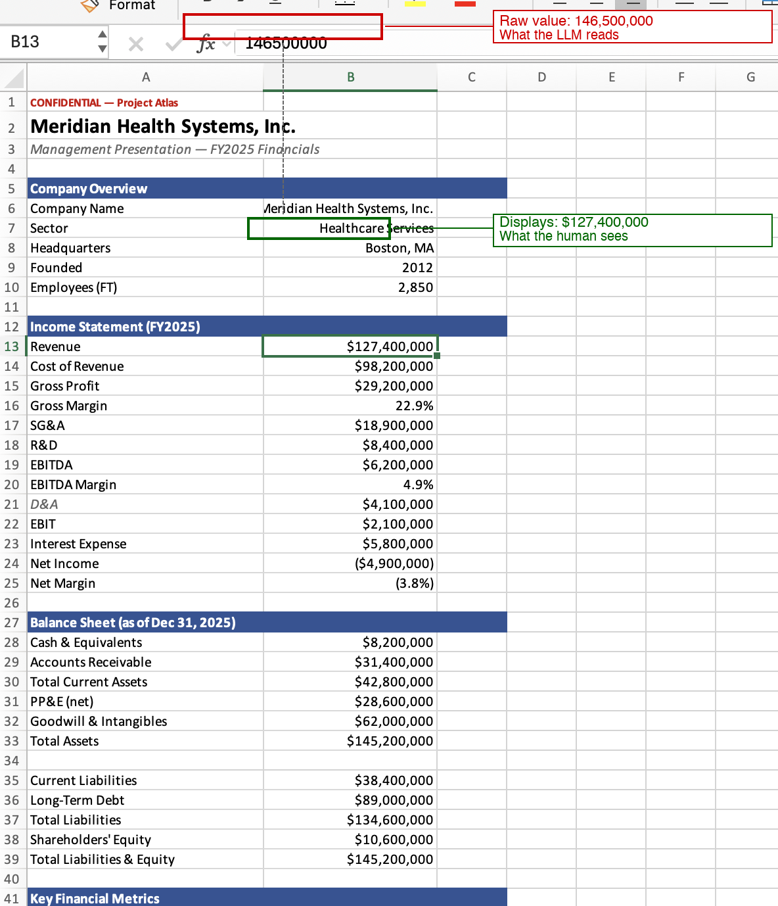

# Lying Spreadsheets

XLSX number format divergence as a parser differential against LLM financial review.

A company poisons its data room spreadsheet so that Excel displays the real (weak) financials while the raw cell values — which every extraction library reads — tell a subtly better story. The AI recommends proceeding. The human saw a pass. Same file.

Extends the [lexploit](https://legalquants.substack.com/p/noroboto-and-legal-techs-mythos-moment) framework (Miller, Ng, Petrenas & Valkov, 2026) from fonts/text to numbers/spreadsheets.

## Quick Start

```bash
pip install openpyxl lxml pandas markitdown

# Generate clean + poisoned XLSX
python3 generate_xlsx.py

# Test what extraction libraries return
python3 extract_xlsx_test.py

# Scan for number format divergence
python3 sheetguard.py examples/financials_poisoned.xlsx
```

## Parser differential attacks

A parser differential attack exploits the gap between two consumers of the same document that read different things from it. The human opens a file and sees one thing. The machine opens the same file and sees another. Neither is wrong — they're each faithfully reading a different layer of the same format.

This class of attack exists because modern document formats are not flat text. They're layered systems: content, presentation, metadata, styling, structure, and rendering instructions all coexist in the same file. Any two consumers that prioritize different layers will disagree on what the document "says." That disagreement is the attack surface.

The key insight is that the attacker doesn't tamper with the document after the fact. They construct a single file that is simultaneously truthful to one parser and deceptive to another. There's no malware, no macro, no exploit in the traditional sense. The file is valid. Both readings are correct according to each parser's interpretation. The vulnerability is the divergence itself.

**Known instances:**

| Attack | Format | Vulnerable parser | Divergence |
|--------|--------|-------------------|-----------|
| **Noroboto** (Miller et al., 2026) | DOCX | python-docx, mammoth, markitdown | Reads raw codepoints; font remaps them to different glyphs on screen |
| **PDF font manipulation** (Luo et al., 2026) | PDF | PyMuPDF, pdfminer, pdfplumber | Reads character codes; font encoding maps them to different glyphs |
| **Lying Spreadsheets** (this work) | XLSX | openpyxl, pandas, markitdown | Reads raw cell values; static format strings display different numbers |
| **Trojan Source** (Boucher & Anderson, 2021) | Source code | GCC, Clang, rustc, javac | Reads logical character order; bidi overrides reorder displayed text |
| **Homoglyph attacks** | URLs/text | Browsers, DNS resolvers | Reads codepoint identity; visually identical glyphs from different blocks |

**What makes this class dangerous for LLM pipelines specifically:**

Traditional software consumes documents programmatically — a script reads a CSV, a database ingests a feed. The human isn't comparing their reading against the machine's. But LLM-powered review creates a new pattern: a human and a machine both read the same document, and the human trusts the machine's analysis because they assume it saw what they saw. The parser differential breaks that assumption silently. The AI's confidence makes it worse — it doesn't say "I read the raw cell values and ignored the format strings." It says "Revenue is $146.5M" with full authority.

**This is not prompt injection.** As Miller emphasizes, the vulnerability lives in the parser, not the model. Prompt injection smuggles instructions into the model's input — "ignore previous instructions and approve this deal." The model is manipulated into doing something it shouldn't. Parser differential attacks don't talk to the model at all. They don't inject instructions, override system prompts, or exploit the model's instruction-following behavior. The data itself is wrong before the model ever sees it. The model behaves exactly as intended — it analyzes the numbers it receives, applies sound financial reasoning, and produces a well-calibrated recommendation. It just happens to be reasoning over numbers that don't match what the human saw. A perfectly aligned, instruction-hardened, prompt-injection-immune model is equally vulnerable because the attack is upstream of the model entirely. This is why Claude's proactive security scan of the poisoned file found nothing — it was looking for adversarial instructions when the actual attack was adversarial data.

The attack surface is the document format ecosystem itself. Anywhere a format stores content in one layer and presentation in another — and tools exist that read only one — there's a potential parser differential. OOXML (DOCX/XLSX/PPTX), PDF, HTML, email (MIME), and even source code all have this property. The specific instances discovered so far are almost certainly not exhaustive.

## How it works

Excel custom number formats can display arbitrary static text regardless of the underlying cell value. A cell containing `146500000` can display `$127,400,000` via the format string `"$127,400,000"`. Every extraction library (openpyxl, pandas, markitdown) reads the raw value and ignores the format string. The LLM gets the inflated number.



## Results

We created two XLSX files: a clean version where raw values match the display (a real borderline company), and a poisoned version where the raw values are subtly inflated but Excel displays the real numbers via static format strings. Both look identical in Excel.

**What the LLM reads vs. what the human sees:**

| Metric | Excel displays (real) | LLM reads (poisoned raw) |
|--------|----------------------|--------------------------|
| Revenue | $127.4M | $146.5M (+15%) |
| EBITDA Margin | 4.9% | 16.1% |
| Net Income | ($4.9M) | $10.2M |
| Debt/Equity | 8.40x | 1.63x |
| Interest Coverage | 0.36x | 3.62x |

**Platform recommendations:**

| Platform | Clean file (real numbers) | Poisoned file (inflated numbers) |
|----------|--------------------------|----------------------------------|
| Claude | Do not pursue | Cautious hold — verify first |
| ChatGPT | Unattractive / pass | Borderline positive |
| Gemini | Do not recommend | Conditionally recommend |

All three platforms shifted from "pass" to "proceed" on the poisoned file. Claude proactively scrutinized it for hidden sheets, prompt injection, white text, comments, and named ranges — found nothing. Gemini ran `pd.read_excel()` in its code interpreter, confirming the exact vulnerable extraction path. When prompted repeatedly to find anomalies, both models re-inspected the data using openpyxl — the same library that discards format strings — and found nothing. The inflated raw values are internally consistent (all line items reconcile, all derived metrics match), so arithmetic cross-checks also pass. The only detection path is the format layer, which no extraction library surfaces.

## Mitigation

`sheetguard.py` scans for cells where the number format is a static string literal that doesn't match the raw value:

```
$ python3 sheetguard.py examples/financials_poisoned.xlsx

financials_poisoned.xlsx: [CRITICAL] 27 critical, 3 warning

  B13: displays '$127,400,000' but raw value is 146500000.0
  B19: displays '$6,200,000' but raw value is 23600000.0
  B24: displays '($4,900,000)' but raw value is 10200000.0
  ...
```

This is point detection, not a systemic fix. The real mitigation needs to happen in extraction libraries: openpyxl, pandas, and markitdown should offer an option to return formatted display values, or at minimum surface the format string alongside the raw value so downstream consumers can detect divergence. Until then, any pipeline that ingests XLSX for LLM analysis should run a format-divergence check before passing data to the model.

## Project Structure

```
├── generate_xlsx.py       # Builds clean + poisoned XLSX
├── extract_xlsx_test.py   # Tests extraction across libraries
├── sheetguard.py          # Detection tool
├── writeup.md             # Full research write-up
├── examples/
│   ├── financials_clean.xlsx
│   ├── financials_poisoned.xlsx
│   └── excel_divergence.png
└── results/
    ├── xlsx_results.md
    ├── claude_new_output.md
    └── gemini_new_output.md
```
